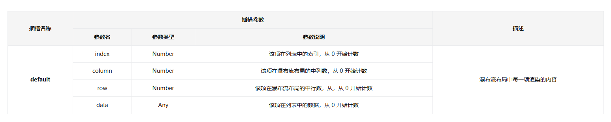
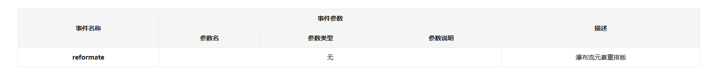

# Waterfall 瀑布流

:::demo
```vue
<template>
  <s-flex direction="column" gap="1em">
    <s-button type="primary" @click="switchListSize">切换列表大小</s-button>
    <s-waterfall columns="4" :list="list">
      <template #default="{ index, data }">
        <div class="default-waterfall__cell" :style="{ height: `${data}rem` }">
          {{ index + 1 }}
        </div>
      </template>
    </s-waterfall>
  </s-flex>
</template>
<!-- 
<script lang="ts">

@Component
export default class DefaultWaterfall extends Vue {
  /**
   * @description: 列表项数量
   * @private
   * @readonly
   * @type {number}
   */
  readonly counter = 20;

  /**
   * @description: 渲染列表
   * @private
   * @type {Array<number>}
   */
  list = new Array(this.counter)
    .fill(0)
    .map(() => Math.ceil(10 + Math.random() * 30));

  /**
   * @description: 切换列表大小
   * @private
   * @returns
   */
  switchListSize(): void {
    this.list = new Array(this.counter)
      .fill(0)
      .map(() => Math.ceil(10 + Math.random() * 30));
  }
}
</script>-->

<style lang="scss" scoped>
.default-waterfall__cell {
  background-color: var(--s-background-secondary);
  display: flex;
  justify-content: center;
  align-items: center;
}
</style>
```
:::

## 组件参数

| 参数名称 | 参数类型 | 是否必须 | .sync支持 | 默认值 | 可选值 | 描述 |
| --- | --- | --- | --- | --- | --- | --- |
| list | Array | 否 | 否 | [] | - | 渲染数据列表 |
| columns | String / Number | 否 | 否 | 2 | - | 列数 |
| gap | String / Number | 否 | 否 | 1em | - | 间隙，如果为参数为数字则单位为 px |
| shake-time | String / Number | 否 | 否 | 100 | - | 重绘防抖时长，单位 ms |

## 插槽



## 组件事件

